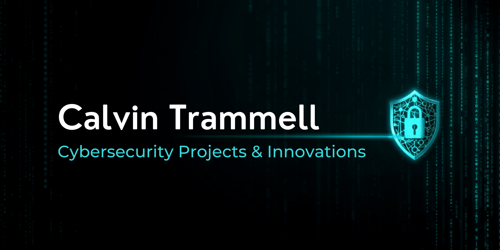

# Hi, I'm Calvin Trammell 👋

## Cybersecurity & Cloud Security Student

I am currently building hands on experience in cybersecurity, cloud security, Linux administration, and SIEM technologies through real world labs and projects.

---

# Technical Skills

- AWS
- Linux
- Wazuh SIEM
- PowerShell
- Networking
- Security Monitoring
- Vulnerability Management
- Windows Administration

---

# Current Focus

- CompTIA Security+
- Cloud Security
- SOC Operations
- Linux Administration
- Detection Engineering

---

# Featured Projects

## AWS CloudWatch Monitoring Lab
Built cloud monitoring and alerting solutions using AWS CloudWatch.

## Wazuh SIEM Lab
Configured and monitored a SIEM environment using Wazuh for log analysis and threat detection.

## AWS Load Balancer Lab
Configured AWS load balancing for traffic distribution and availability testing.

---

# Volunteer Experience

## The Cyber Helpline
Providing cybersecurity support while gaining hands on experience with security awareness and incident response workflows.

---

# Connect With Me

- LinkedIn: www.linkedin.com/in/calvin-trammell-56675295
